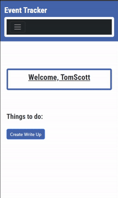

# EventTracker
 
## Description

 This application is a database that helps a company store team member data that is related to documentation, enabling them to easily record and access any team member infractions. 

 This application provides functionality to both members of management as well as general team members to be able to catalog and resolve infractions. EventTracker securely stores employee personal documentation data, limiting access to only their own files. Managers, however, will have access to unacknowledged writeups from all the team members. 

 **Features include**:

 - **Employees**:
     - Provide employees with mobile and secure access to their documented writeups and warnings
     - Allows employees to respond to infractions directly through the webpage, providing communication routes between general employees and managers
     - Employees can acknowledge the writeup and it shall be considered resolved and archived
    - Employees can view current and previous writeups
- **Managers**: 
    - Managers can submit reports through a short and intuitive webpage
    - Recorded infractions will automatically appear on an employee's page
    - When managers log in, they receive a streamlined webpage highlighting currently unacknowledged writeups
    - Managers can delete unacknowledged writeups at their discretion 

 ## Table of Contents
- [Packages](#packages)
- [Usage](#usage)
- [License](#license)
- [Credits](#credits)

## Packages
 The event tracker utilizes several different packages in order for it to run. 
 * [Bootstrap](https://getbootstrap.com/)
 * [Passport.js](https://www.passportjs.org/)
 * [PostgreSQL](https://www.postgresql.org/)
 * [Handlebars](https://handlebarsjs.com/)

The application uses:

-  **PostgreSQL** to handle storing data, allowing for easy retrieval by the user through the deployed interface. 
- **Passport** package to ensure that each employee has access only to their own respective portals through user authentication. 
- **Handlebars** is being used as the template engine.
- **Bootstrap** is used to create an organized, responsive, and stylish interface.

 ## Usage

- **First-time Users**:
    - First time users will need to create an account with a valid email, a unique username, a 8 character password, and a response whether they are a manager
    - For employers, registering accounts for employees in the onboarding process can ensure smooth functionality down the road. 

    - Once a you will need to log in to access any of your data. 
        - We will do separate walkthroughs to show the flow for each level of employee to show how to access and use the data.

- **Returning Users**:

    - Visit the "Login" page to sign in with your registered username and password
    - You will be redirected to your appropriate webpage with appropriate information and functionality 

### EMPLOYEE
The employee side of the application allows you view unacknowledged infractions and past infractions you have acknowledged. Any unacknowledged infractions give you the opportunity to add comments, questions, or concerns you might have about them.

  ### MANAGER
  The manager side of the application allows you to view unacknowledged infractions, create new infractions, add comments to existing infractions, and delete infractions in case of mistake.

 

## License
This project is licensed under the MIT license. 
 

 ## Credits
This application was created by [Drew Hermanson](https://github.com/drewhermanson), [Anthony Rodriguez-Ortiz](https://github.com/anthonyero) and [Caryn Behnke](https://github.com/Magicaryn). Any questions, comments, concerns, or ideas for improvement please feel free to reach out to Behnke.ca@gmail.com

## Link to the deployed application

https://eventtracker.onrender.com

## Link to the GitHub repository

https://github.com/Magicaryn/EventTracker
