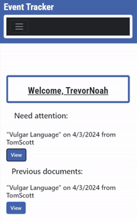

# EventTracker
 

 ## Summary

 This application is a database that helps a company store team member data that is related to documentation, enabling them to easily record and access any team member infractions. This application has the ability for both a member of management as well as team members to be able to log in and view these infractions. However, let it be noted that the team members will only be able to access their personal documentation data. Managers will be able to view the data from all the team members. 

 ## Table of Contents
- [Packages](#packages)
- [Usage](#usage)
- [License](#license)
- [Credits](#credits)

## Packages
 The event tracker utilizes several different packages in order for it to run. 
 * [Bootstrap](https://getbootstrap.com/)
 * [Passport](https://www.passportjs.org/)
 * [Postgres](https://www.postgresql.org/)
 * [Handlebars](https://handlebarsjs.com/)

The application uses **Postgres** to handle storing data, allowing for easy retrival by the user through the deployed interface. The application uses the **Passport** package to ensure that each employee has access only to their own respectic portals. **Handlebars** is being used as the template engine and last but not least **Bootstrap** is used to create an organized and stylish look.

 ## Usage
  When you first access the page you have the option to log in or sign up. Any first time user will need to sign up to create their account in the database. This means, as an employer, it would be part of the hiring process to get the employee signed up to ensure smooth functionality down the road. 

  Once you have finished the sign up process, you will need to log in to access any of your data. We will do separate walk throughs to show the flow for each level of employee to show how to access and use the data.

  ### MANAGER
  The manager side of the application allows you to view unacknowledged infractions, create new infractions, add comments to existing infractions, and delete infractions in case of mistake.

 

  ### EMPLOYEE
The employee side of the application allows you view unacknowledged infractions and past infractions you have acknowledged. Any unacknowledged infractions give you the opportunity to add comments, questions, or concerns you might have about them.

## License
This project is licensed under the MIT license. 
 

 ## Credits
This application was created by Drew Hermanson, Another Rodriguez-Ortiz and Caryn Behnke. Any questions, comments, concerns, or ideas for improvement please feel free to reach out to Behnke.ca@gmail.com

## Link to deployed application

https://eventtracker.onrender.com

## Link to github repository

https://github.com/Magicaryn/EventTracker